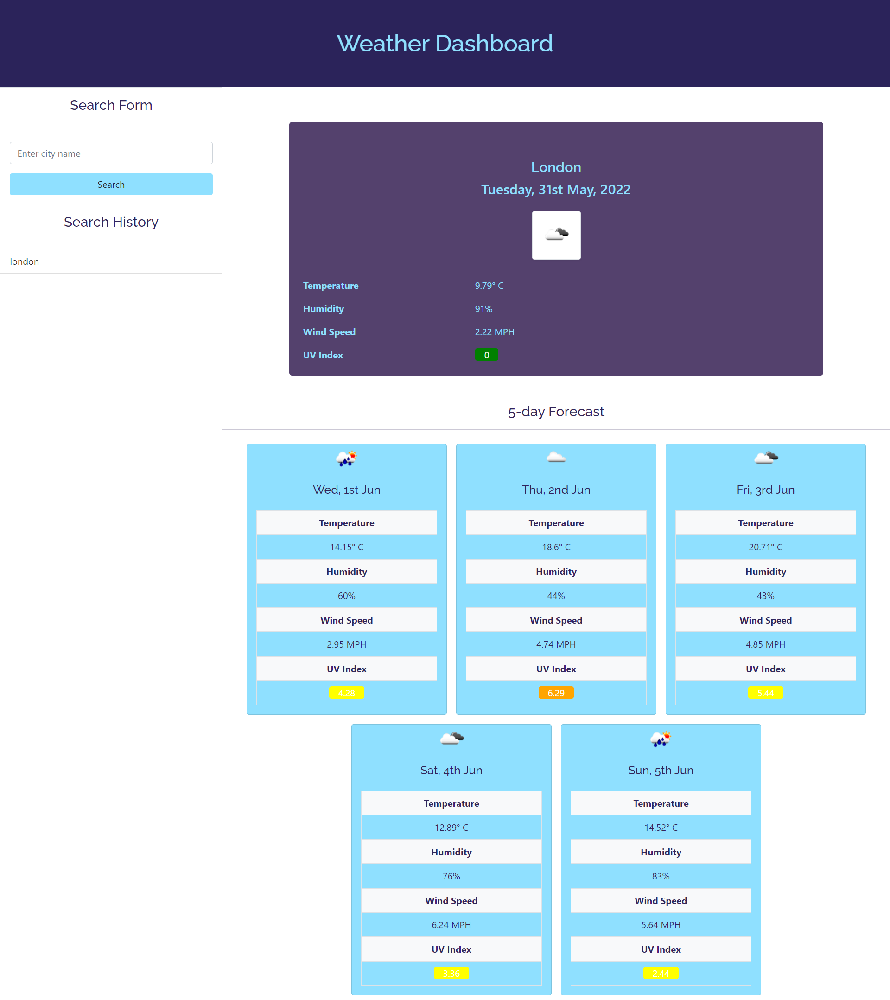

# weather-dashboard

This weather dashboard project uses the OpenWeather One Call API to retrieve weather data for cities so that the user can search a city by name and view the current weather conditions and a 5 day forecast. The user search history is saved on ```local storage``` so the user can view the weather information again on any city previously saved. 

## Deployed Page and Repository

[Deployed page](https://nsharma-uk.github.io/weather-dashboard/)


[Repository](https://github.com/nsharma-uk/weather-dashboard)
<br>
<br>


<br>
<br>

## Technologies

- HTML
- CSS
- JavaScript
- Bootstrap
- Google Fonts
- Fontawesome
- jQuery
- 3rd Party API:  [OpenWeatherMap](https://openweathermap.org/api)
  <br>
  <br>

## Project Details - User Story
<br>

```
AS A traveler
I WANT to see the weather outlook for multiple cities
SO THAT I can plan a trip accordingly
```

<br>

## Project Details - Acceptance Criteria
<br>

```
GIVEN a weather dashboard with form inputs
WHEN I search for a city
THEN I am presented with current and future conditions for that city and that city is added to the search history
WHEN I view current weather conditions for that city
THEN I am presented with the city name, the date, an icon representation of weather conditions, the temperature, the humidity, the wind speed, and the UV index
WHEN I view the UV index
THEN I am presented with a color that indicates whether the conditions are favorable, moderate, or severe
WHEN I view future weather conditions for that city
THEN I am presented with a 5-day forecast that displays the date, an icon representation of weather conditions, the temperature, the wind speed, and the humidity
WHEN I click on a city in the search history
THEN I am again presented with current and future conditions for that city
```

## Authored by

N Sharma
<br>
<br>

## Contact

Email: nsharma711@gmail.com <br>
GitHub: [github.com/nsharma-uk](https://github.com/nsharma-uk)<br>
Twitter: [@NSharmaUK](https://twitter.com/NSharmaUK)


